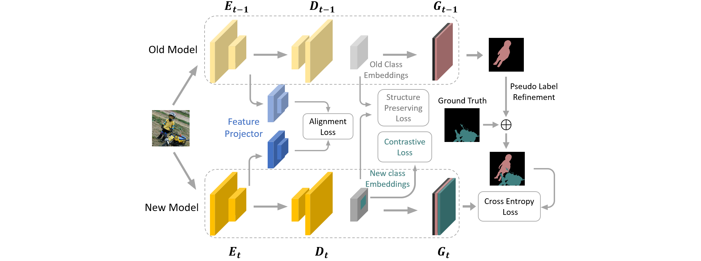

# SPPA

This is the reference code of work: "Continual Semantic Segmentation via Structure Preserving and Projected Feature Alignment" published at ECCV22.

 

## requirements

The experiments is performed using the following libraries

- Python (3.9)
- Pytorch (1.9.1)
- torchvision (0.10.1)
- tensorboard (2.5.0)
- numpy (1.21)

## Datasets

In this work, we use VOC2012 and ADE20K. They can be easily downloaded from their official website

## Perform Training

The entrance is `main.py`. Simply do `python main.py [options]` to perform training. The key paramters are listed as follows:

- `data_root`: path to dataset folder
- `task`: select the tasks defined in `datasets/tasks.py`
- `batch_size`: batch size per GPU = batch_size/num_GPU
- `epochs`: 30 for VOC and 60 for ADE20K
- `lr`: the list of learning rate for each step defined in `task`. For example, use [7e-3, 7e-4] for 15-5 VOC.
- `logging_path`: path to log all training information

All supported CLI parameters can be found in `utils/argparser.py`. Most parameters can use their default value and left untouched but feel free to adjust them if needed.

If you want to do testing, specify the following parameters:

- `ckpt`: path for model checkpoint
- `ckpt_model_only`: load model parameters only
- `test_only`: perform testing

## Key components

The definition and training code of the projector module lie in `modules/projector.py` and `modules/transnet.py`. The projector is optimized using SGD witm momentum. It is trained with a batch size of 32 for 1.5K iters on VOC and 3K iters on ADE. the learning rate is 1e-1 for the first 75% iters and 1e-2 for the rest. 

All the losses we proposed in this work lie in `utils/loss.py` with detailed Docstrings. They can be easily integrated with little modification in other code base or tasks.

## Hyper-parameters

The hyper-parameters of our method can be set as follows. Note that the best parameters may vary across datasets and setups.

- L_ali: alpha can be between 10 to 100, we use 30.
- L_str: beta can be between 1 to 100, we use 10. nu * beta can be between 1e-2 to 1e-1, we use 1e-1.
- L_cont: gamma can be between 1e-3 to 1e-1, we use 1e-2. usually mu = 1 is good.
- pseudo label: T_c is selected to keep 80% percent of the raw pseudo labels

